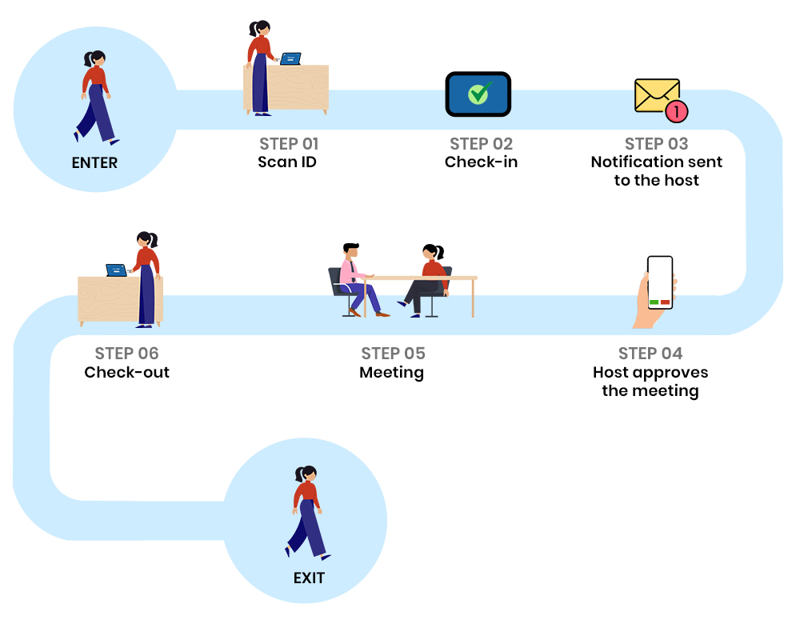

# visitor management

helps in managing visitors visiting the institutions for various reasons. It allows visitors to check-in digitally to eliminate the tedious registeration and other paperwork. Additionally, it also keeps a track of every individual inside the campus and their timings. Institutions has guards who enter their detail in some notebooks to keep a log which are practically impossible to reconcile. It is really unpleasent and hectic for visitor to stand at the gate and give details about the visit. To ease the process of registeration, Entry-In, Entry-Out, time tracking and logging the history, this VMS can be of great use!! 

# Live Demo
+ http://106.52.105.140:6103/ (Please use IP access if you are from outside China)
+ [https://visitor.blazorserver.com/](https://visitor.blazorserver.com/)

# Process flow

## Development Environment
- Microsoft Visual Studio Community 2022 (64-bit)
- SQL Server Express 2019 LocalDB
- Docker
- .NET 7.0
  
Remember to install LocalDB in visual studio 2022.

## Debugging and Running in Visual Studio 2022
1. Clone the repo. cmd: `git clone https://github.com/neozhu/visitormanagement.git`
2. Go to the project folder and open `CleanArchitecture.Blazor.sln`
3. Debugging it.
4. 

## Docker compose https deployment
- Create self-signed development certificates for the project
    - cmd: `dotnet dev-certs https -ep $env:USERPROFILE\.aspnet\https\Blazor.Server.UI.pfx -p Password@123`
    - cmd: `dotnet dev-certs https --trust`
- Manage User secrets to save password 
    - cmd: `dotnet user-secrets init `
    - cmd: `dotnet user-secrets -p Blazor.Server.UI.csproj set "Kestrel:Certificates:Development:Password" "Password@123"`
## Docker compose run
- cd project directory eg:  .\vsitormanagement
    - cmd: `docker-compose -f ./docker-compose.yml up --build -V --remove-orphans`

# Features of Visitor Pass Management System Software
  + Ease of Use.
  + Smart visitor service with pre-registered , pre-visitor or can be
  + registered quickly, check-in, visitors are made to feel expected and welcome.
  + Attractive Dashboard Report with (Employees,Bookings,Visitors,Book Details etc)
  + Add User with different types information specially roles
  + Employee full details with Booking and Attendance Details
  + Add Attendance and Add Bookings with Booking Group Details
  + Visitor’s Dynamic Information
  + Pre-Register Information
  + Settings : General, Notification, Photo & Card Id,
  + Email & Sms template, Email,  Front-end Settings
  + Notifications that Match Receivers’ Preferences.
  + Preregistration and Repeat Visitor Features.
  + Visitor Photo Capture.
  + Visitor Badge Printing.
  + Legal Document eSignature Capture.
  + Cloud-Based Visitor Logbook.
  + Secured Data.
  + Fast Processes More visitors in less time span
  + Appointment scheduler A centralized web-based appointment scheduler
  + Alerts Email/SMS and IP phone integration is available

# About Project
+ Language: DotNet c#
+ Server: IIS, Docker
+ Platform: Windows, Linux, MacOS
+ Database: SQL Server
+ Design UI: MudBlazor
+ Browser: Chrome, Firefox, Safari, IE, Edge
+ Hosting: Azure, Digital Ocean, AWS, Heroku

# The End
give me your feedback and suggestions.
